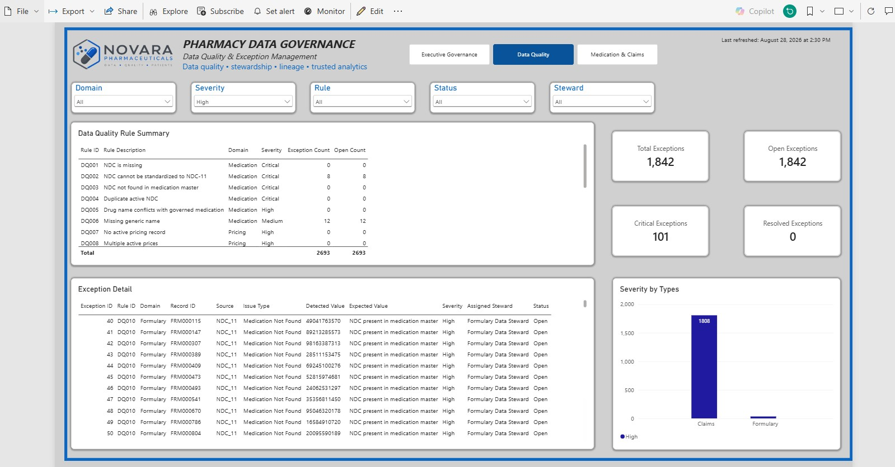
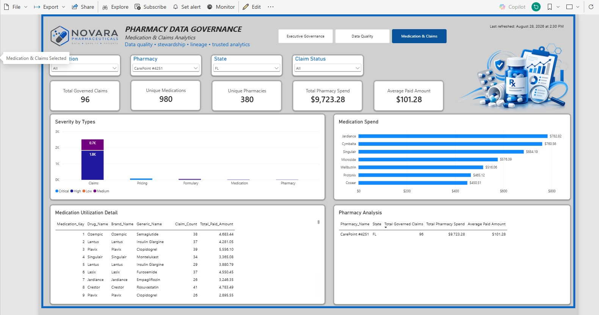

# Pharmacy Data Governance & Trusted Analytics Platform

## Project Overview

Healthcare and pharmacy analytics depend heavily on the **quality, consistency, traceability, and governance** of the underlying data.

This portfolio project demonstrates an **end-to-end pharmacy data governance workflow**, beginning with synthetic source data and progressing through data ingestion, staging, data-quality validation, exception management, governed datasets, reporting views, and finally Power BI analytics.

The goal was not simply to build a dashboard.

The goal was to demonstrate the processes required to make the data behind that dashboard **reliable, explainable, and fit for analytical use**.

> **Note:** All data used in this project is synthetically generated and contains no protected health information (PHI).

---

## Business Problem

Pharmacy data commonly originates from multiple systems and domains, including:

- Medication reference data
- Pharmacy master data
- Formularies
- Drug pricing
- Pharmacy claims

Before this data can be trusted for reporting or decision-making, organizations need mechanisms to identify issues such as:

- Duplicate claims
- Missing or invalid NDC values
- Invalid pharmacy identifiers
- Missing reference records
- Negative or zero pricing
- Inconsistent state values
- Invalid formulary tiers
- Unexpected paid amounts
- Invalid days supply

This project models a governance framework for **identifying, documenting, assigning, and resolving data-quality issues before the data reaches downstream analytics**.

---

## Architecture

```text
Synthetic Data Generation
        │
        ▼
      Python
        │
        ▼
SQL Server RAW Layer
        │
        ▼
   STAGING Layer
Standardization + Validation
        │
        ▼
DATA QUALITY / GOVERNANCE
Rules + Exceptions + Stewardship
        │
        ▼
   GOVERNED Layer
Trusted Dimensions + Facts
        │
        ▼
   REPORTING Views
        │
        ▼
     Power BI
  Trusted Analytics
```

The architecture intentionally separates the **raw, staging, governance, governed, and reporting layers** so that source values remain traceable throughout the pipeline.

---

## Technology Stack

### Data Generation & Profiling

- Python
- pandas

### Database & Transformation

- SQL Server
- T-SQL

### Data Governance

- Data-quality rules
- Exception management
- Business glossary
- Data ownership and stewardship
- Data lineage
- KPI definitions
- Reporting inventory

### Analytics & Visualization

- Power BI
- DAX
- Data modeling

---

## Synthetic Source Data

Python was used to generate five synthetic pharmacy datasets:

| Dataset | Purpose |
|---|---|
| **Drug Reference** | Medication and NDC reference information |
| **Pharmacy Master** | Pharmacy names, NPI, location, and reference information |
| **Formulary** | Medication coverage and formulary tiers |
| **Drug Pricing** | Medication pricing and methodology |
| **Pharmacy Claims** | Synthetic pharmacy transactions |

Intentional data-quality issues were introduced into the source data so the governance framework could identify and manage realistic data problems.

---

## Data Architecture

The SQL Server environment is organized into five schemas.

### `raw`

Preserves the original source data before transformation or validation.

The raw layer provides traceability back to the original source values.

### `staging`

Standardizes and prepares incoming data while preserving original source values for validation and investigation.

Typical staging activities include:

- Standardizing identifiers
- Normalizing formats
- Preparing records for validation
- Identifying potential data-quality problems
- Preserving original values for traceability

### `governance`

Stores governance metadata and operational data-quality information, including:

- Data-quality rules
- Data-quality exceptions
- Business glossary definitions
- Data owners
- KPI definitions
- Data lineage
- Reporting inventory

### `governed`

Contains validated and trusted analytical entities.

Examples include:

- `dim_medication`
- `dim_pharmacy`
- `dim_formulary`
- `fact_drug_pricing`
- `fact_pharmacy_claim`

Only records meeting defined governance and quality requirements are promoted into the governed analytical layer.

### `reporting`

Provides curated SQL views designed specifically for downstream analytics and Power BI reporting.

This layer separates reporting requirements from the underlying operational and governance tables.

---

## Data Quality Framework

The project includes **20 data-quality rules** covering multiple pharmacy data domains.

Examples include:

| Rule ID | Description |
|---|---|
| **DQ001** | Missing NDC |
| **DQ002** | Invalid NDC standardization |
| **DQ004** | Duplicate active NDC |
| **DQ009** | Zero or negative drug pricing |
| **DQ010** | Formulary NDC not found |
| **DQ011** | Invalid formulary tier |
| **DQ013** | Duplicate pharmacy claim |
| **DQ014** | Negative paid amount |
| **DQ015** | Pharmacy not found |
| **DQ016** | Duplicate NPI |
| **DQ017** | Missing NPI |
| **DQ018** | Invalid state |
| **DQ019** | Paid claim with zero paid amount |
| **DQ020** | Invalid days supply |

Each detected exception can be associated with:

- Source system
- Source table
- Source field
- Rule ID
- Affected record
- Severity
- Detected value
- Expected value
- Assigned data steward
- Status
- Resolution information

This allows data-quality issues to become **visible and actionable instead of being silently corrected during reporting**.

For additional details, see Data Quality Rules under the Documentation folder.

---

# Power BI Reporting

The final Power BI report contains **three pages**, each designed to answer a different governance or analytical question.

---

## 1. Executive Governance Overview



Provides an executive view of overall data-governance health, including:

- Governed claim percentage
- Total data-quality exceptions
- Open exceptions
- Critical exceptions
- Governed medications
- Governed pharmacies
- Governed pharmacy spend
- Exceptions by data domain
- Severity distribution
- Top data-quality rules
- Raw-to-governed claims pipeline

One of the primary metrics is the percentage of pharmacy claims that successfully pass governance rules and enter the trusted analytical layer.

**Primary question:**

> Can we trust the data being used for reporting and analytics?

---

## 2. Data Quality & Exception Management


Designed as an operational governance workspace for investigating data-quality problems.

Users can filter exceptions by:

- Domain
- Severity
- Rule
- Status
- Assigned steward

The page provides both summarized rule-level information and record-level exception detail.

**Primary question:**

> What is wrong, where is it occurring, how severe is it, and who is responsible for resolving it?

---

## 3. Medication & Claims Analytics



Demonstrates the analytical value created **after governance has been applied**.

The page includes:

- Governed claim activity
- Unique medications
- Unique pharmacies
- Total pharmacy spend
- Average paid amount
- Medication utilization
- Medication spend
- Pharmacy-level analytics

This page intentionally uses the **governed reporting layer rather than raw pharmacy data**.

**Primary question:**

> What can we confidently learn from the data once governance and validation have been applied?

The objective is to demonstrate that governance is not separate from analytics—it is part of what makes downstream analytics trustworthy.

---

# Key Project Results

The synthetic environment generated approximately **50,000 pharmacy claims**.

After data-quality and governance rules were applied, approximately **66% of claims qualified for the governed analytical layer**.

The difference between raw and governed claims was intentionally made visible rather than silently correcting source issues.

This allows stakeholders to understand not only the final reporting results, but also the **quality of the data supporting those results**.

---

# Governance Design Principles

Several principles guided the design of this project.

### Preserve the Source

Original source values are retained rather than overwritten so analysts and data stewards can trace issues back to their origin.

### Do Not Silently Fix Bad Data

Invalid values are identified and documented before records are promoted into the governed layer.

### Separate Governance from Analytics

Operational data-quality management and trusted analytical reporting serve different purposes and are modeled separately.

### Make Ownership Visible

Exceptions include stewardship and status information so governance becomes an operational process rather than only a technical exercise.

### Build Lineage into the Architecture

Data movement from source through staging, governance, governed datasets, reporting views, and Power BI is explicitly documented.

### Report from Trusted Data

Downstream analytical reporting uses governed data rather than reporting directly from raw source records.

---

# Repository Structure

```text
pharmacy-data-governance-platform/
│
├── README.md
│
├── requirements.txt
│
├── data/
│   ├── README.md
│   └── sample/
│
├── python/
│   ├── generate_pharmacy_data.py
│   ├── generate_quality_rules.py
│   └── profile_datasets.py
│
├── sql/
│   ├── 01_create_database_and_schemas.sql
│   ├── 02_create_raw_tables.sql
│   ├── 03_create_staging_tables.sql
│   ├── 04_create_governance_tables.sql
│   ├── 05_create_governed_tables.sql
│   ├── 06_load_staging.sql
│   ├── 07_data_quality_rules.sql
│   ├── 08_build_governed_layer.sql
│   └── 09_reporting_views.sql
│
├── documentation/
│   ├── architecture.md
│   ├── data-quality-rules.md
│   ├── data-dictionary.md
│   └── lineage.md
│
├── powerbi/
│   └── Pharmacy_Data_Governance.pbix
│
└── images/
    ├── executive-governance.png
    ├── data-quality-exceptions.png
    ├── medication-claims-analytics.png
    └── architecture-diagram.png
```

---

# Documentation

Additional project documentation is available in the `documentation` folder:

- Architecture — End-to-end technical architecture and layer design
- Data Quality Rules — Data-quality rule catalog and exception framework
- Data Dictionary — Definitions of key tables, fields, and reporting objects
- Data Lineage — Source-to-report data movement and downstream impact

---

# What I Learned

This project reinforced an important principle:

> **A dashboard is only as trustworthy as the data processes behind it.**

The Power BI report is the visible end product, but most of the work happens earlier:

- Defining business rules
- Understanding source data
- Validating records
- Identifying exceptions
- Documenting definitions
- Establishing ownership
- Creating lineage
- Building trusted datasets
- Designing reporting views

The final visualization is therefore not the beginning of the analytics process.

**It is the result of it.**

---

# Future Enhancements

Potential next steps include:

- Historical data-quality trend tracking
- Automated exception workflow
- Data steward resolution metrics
- Power Automate notifications
- Additional pharmacy cost and utilization analytics
- Automated data profiling
- Expanded lineage visualization
- Microsoft Purview or another metadata/governance platform integration

---

# Skills Demonstrated

`Data Governance` · `Data Quality` · `Data Lineage` · `Data Stewardship` · `SQL Server` · `T-SQL` · `Python` · `pandas` · `Power BI` · `DAX` · `Data Modeling` · `Business Intelligence` · `Data Analytics` · `Root Cause Analysis` · `Technical Documentation`

---

# Author

**Catherine McKillips**

Data Analyst | Business Intelligence | Data Governance | Power BI | SQL | Python

[LinkedIn](https://www.linkedin.com/in/catherine-mckillips-data-analytics/)
